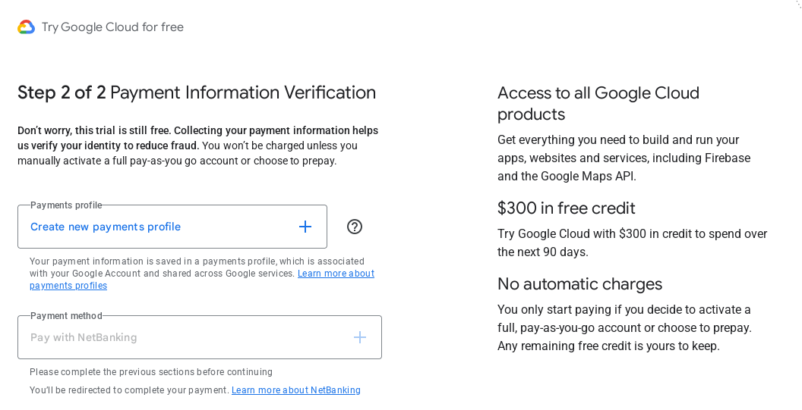

# For getting started with GCP we need to create Payment Profile

## Create a payments profile

> Only Organization profiles can have multiple users. If you select an Individual profile, you agree that use of your profile is for your trade, business, craft, or profession. In some countries, this selection affects your tax options. Your profile type can’t be changed after signing up. Learn more about payments profiles

### Profile type:  Organization

- Organization name

- Legal name

- Street address

- Apt, suite, etc. (optional)

- City

- Pin code

- State

### Profile type: Individual

- Legal name

- Street address

- Apt, suite, etc. (optional)

- City

- Pin code

- State

---

- [More information](https://support.google.com/paymentscenter/answer/9028746)

> Your payment method requires you to make a one-time, ₹1,000.00 prepayment. Once this prepayment is credited to your account, you'll also receive your free trial credits and your free trial will become active. This prepayment is refundable if you choose to close your Cloud billing account. Learn more about payment methods

This seems a bit sneaky

## Resource:

- [How to Create GCP Free Tier Account-Hindi/Urdu | Lec-06 | Google cloud platform Free trial account](https://youtu.be/VXi3Q8KMlyU?list=PLBGx66SQNZ8YWRUw6yicKtD4AIpUl_YiJ)

