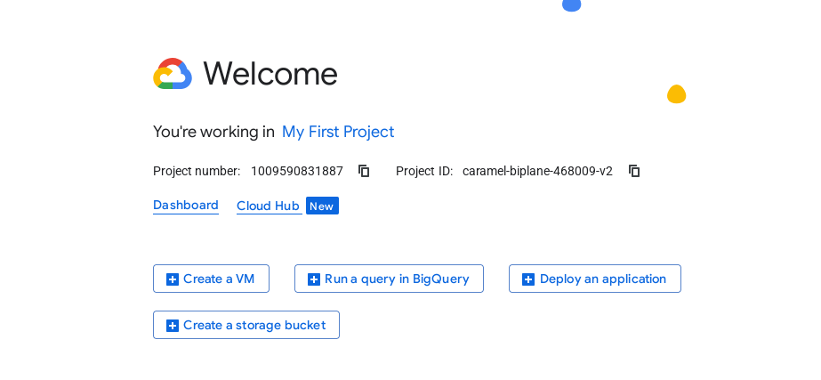

# Compute

- Compute (Server backed)
    - Compute Engine
    - K8s Engine
    - VMWare engine

- Compute (Serverless)
    - App engine
    - Cloud Run
    - Cloud functions

## VM instanc

- Creating instance, similar to ec2

## Resources:

- [Google Cloud Compute Engine Part-1 Hindi/Urdu | Lec-07| गूगल क्लाउड I Types of VM in Google cloud](https://youtu.be/OqtrqOAOZSY?list=PLBGx66SQNZ8YWRUw6yicKtD4AIpUl_YiJ)

- [How to install apache on GCP linux server-Hindi/Urdu | Lec-11 | GCP-ACE Tutorials | GCP-PCA Tutorial](https://youtu.be/QWO0R5VJsBE?list=PLBGx66SQNZ8YWRUw6yicKtD4AIpUl_YiJ)

- [Compute Engine terminology](https://cloud.google.com/compute/docs/machine-resource)
    - Machine family
        - Machine series
            - Machine type

    - https://cloud.google.com/compute/docs/machine-resource#shared-core-types

